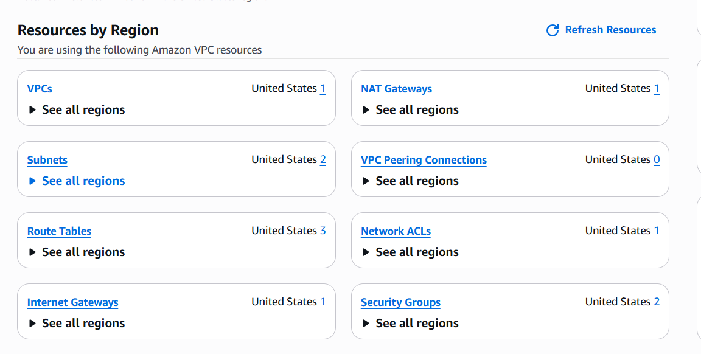
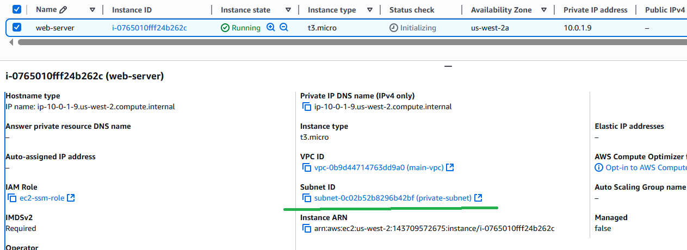
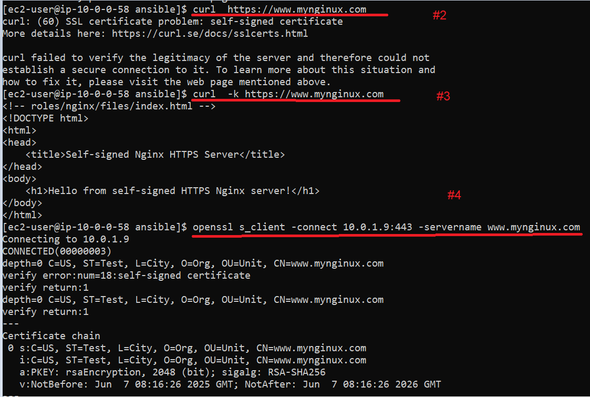
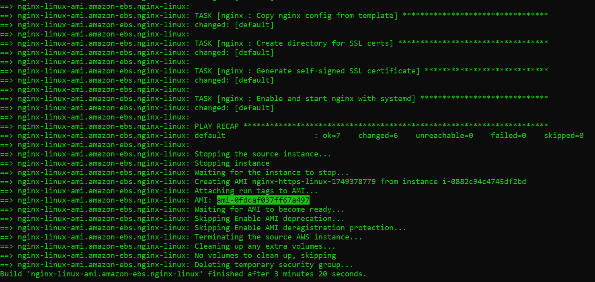
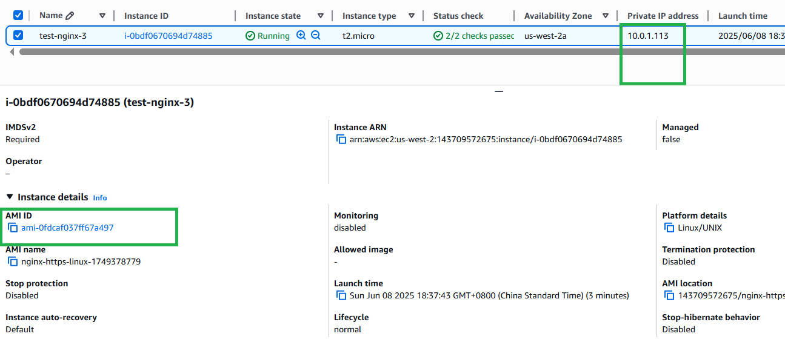
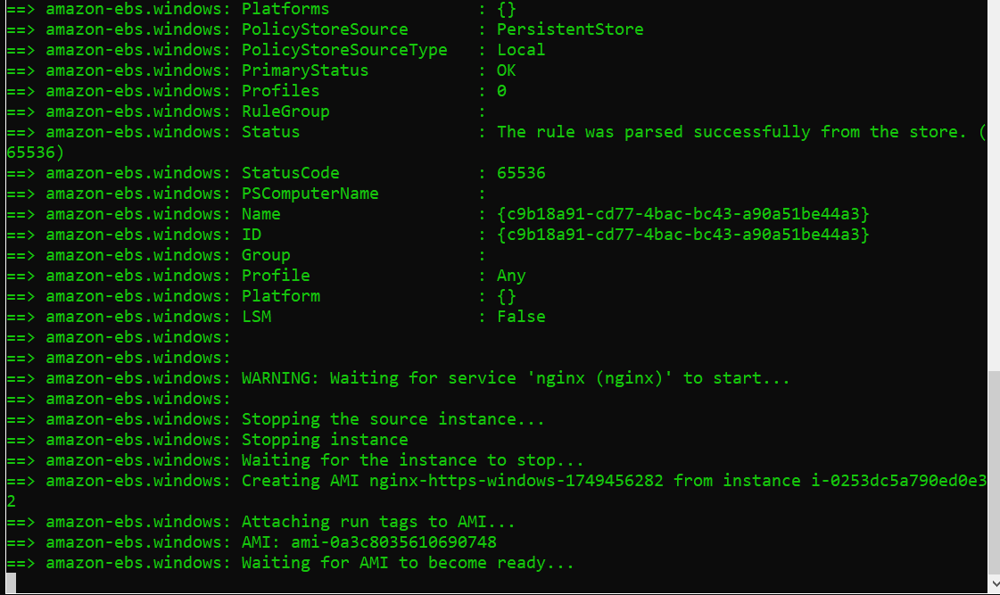
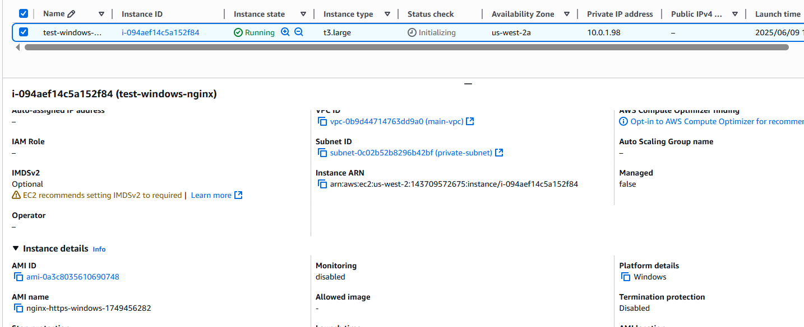
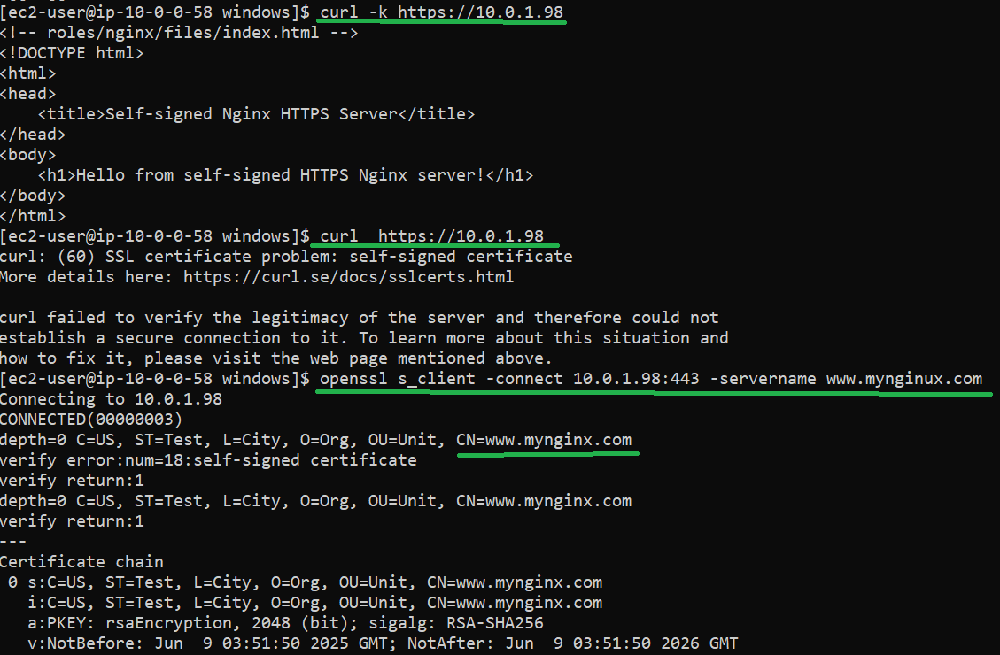

## Deliverables

### * Terraform

1. manually created a bastion server in public subnet for scripts execution and test, decommissioned afterwards.
2. VPC overview - VPC, Subnets (1 public and 1 private), NAT Gateway, Internet Gateway, Route Tables, Security Groups.
   
3. VPC details
   
4. EC2 for nginx server in private subnet
   

### * Ansible

1. manually added domain mapping to /etc/hosts of bastion server so that nginx server is accessible by domain name
   `echo "10.0.1.9 www.mynginux.com" | sudo tee -a /etc/hosts`
2. access the self-signed nginx server in a normal way did not work
3. access with -k allowing insecure server connections did work
4. inspect certificate and CN
   

### * Packer

1. built nginx linux AMI - ami-0fdcaf037ff67a497. For debugging the build EC2 was in public subnet, however it can be in private subnet.
   
2. launched an EC2 with the AMI
   
3. verity https access and self-signed certificate
   
4. built nginx Windows AMI - ami-0a3c8035610690748
   
5. launched an EC2 from the Windows AMI in private subnet
   
6. verity https access and self-signed certificate
   
7. manually reused self-signed certificate for Windows