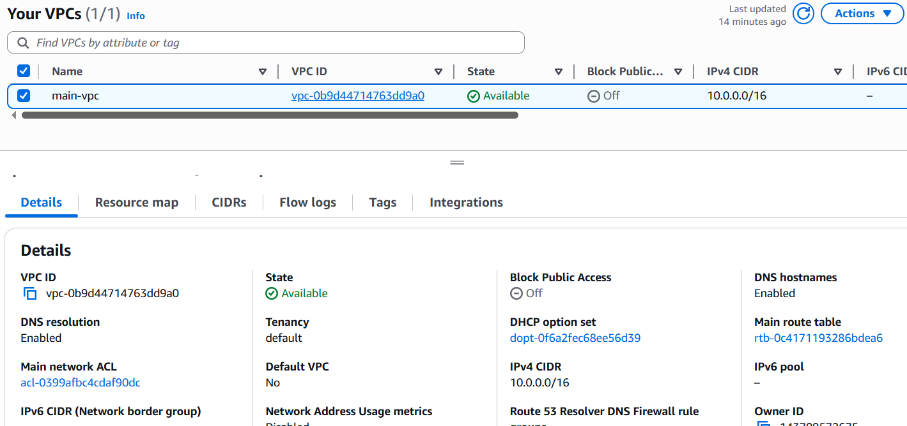
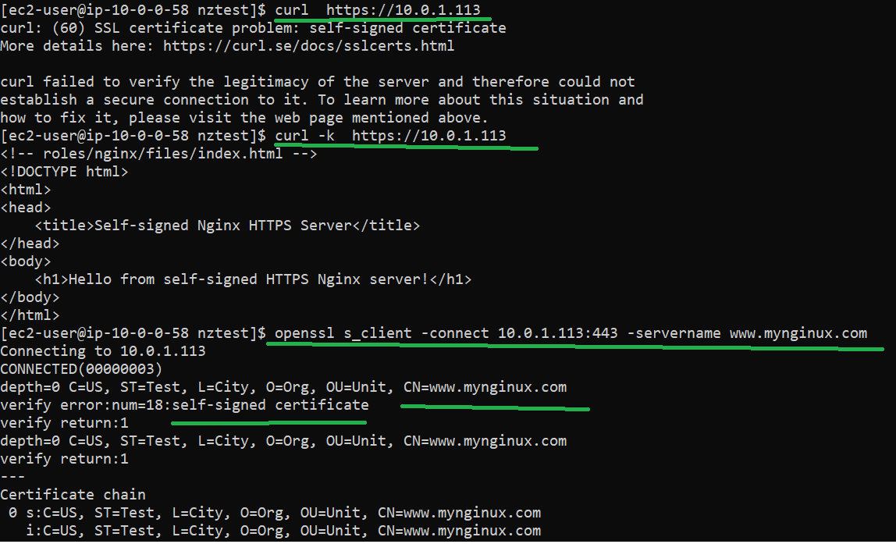

## Deliverables

### * Terraform

1. manually created a bastion server in public subnet for scripts execution and test
2. VPC overview - VPC, Subnets, NAT Gateway, Internet Gateway, Route Tables, Security Groups.
   
3. VPC details
   
4. EC2 for nginx serve
   

### * Ansible

1. manually added domain mapping to /etc/hosts of bastion server so that nginx server is accessible by domain name
   `echo "10.0.1.9 www.mynginux.com" | sudo tee -a /etc/hosts`
2. access the self-signed nginx server in a normal way did not work
3. access with -k allowing insecure server connections did work
4. inspect cert and CN

### * Packer
1. built nginx linux AMI - ami-0fdcaf037ff67a497

2. launched an EC2 with the AMI

3. verity https access and self-signed certificate

